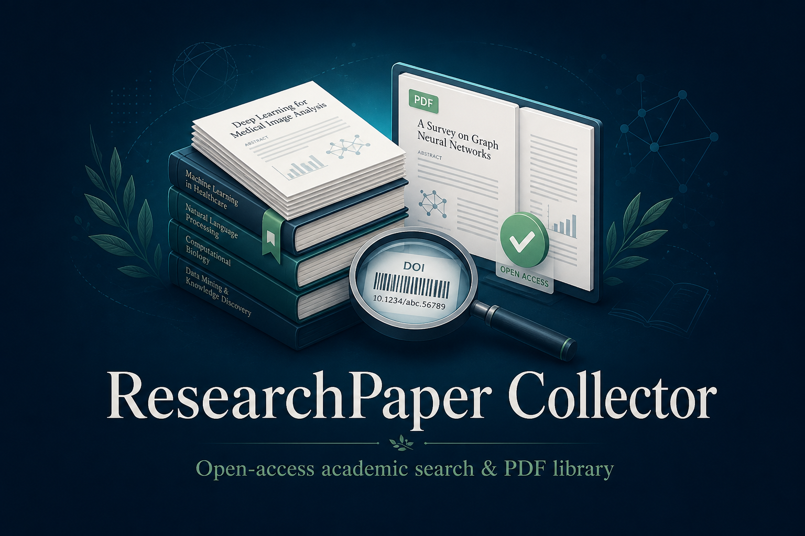
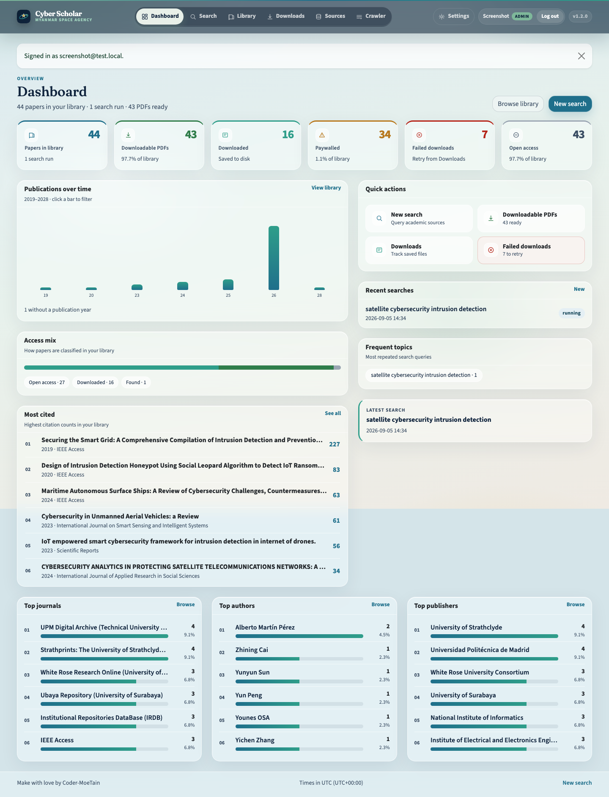
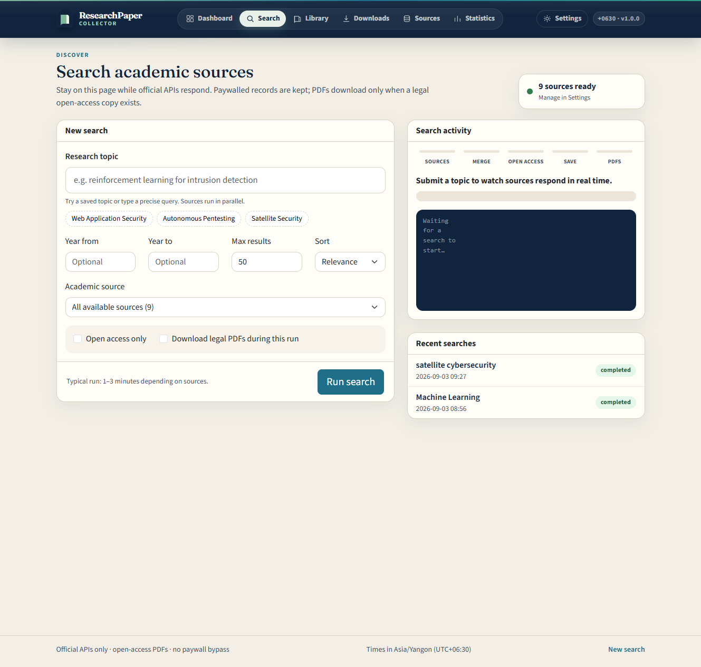
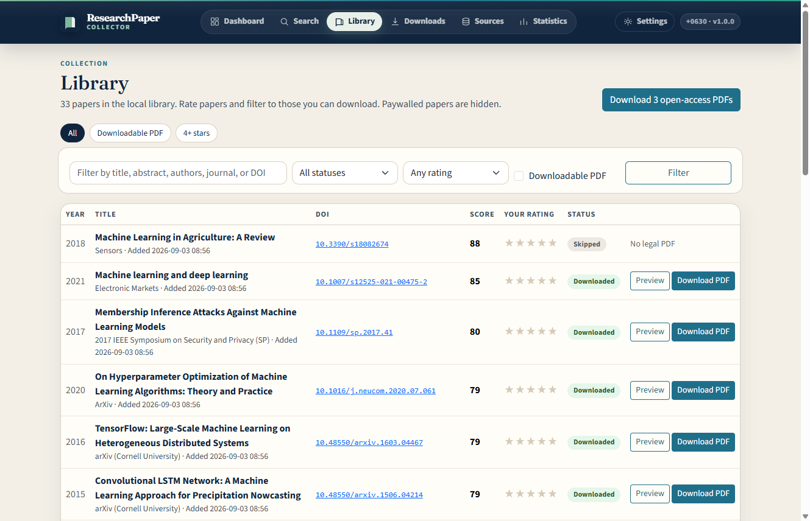
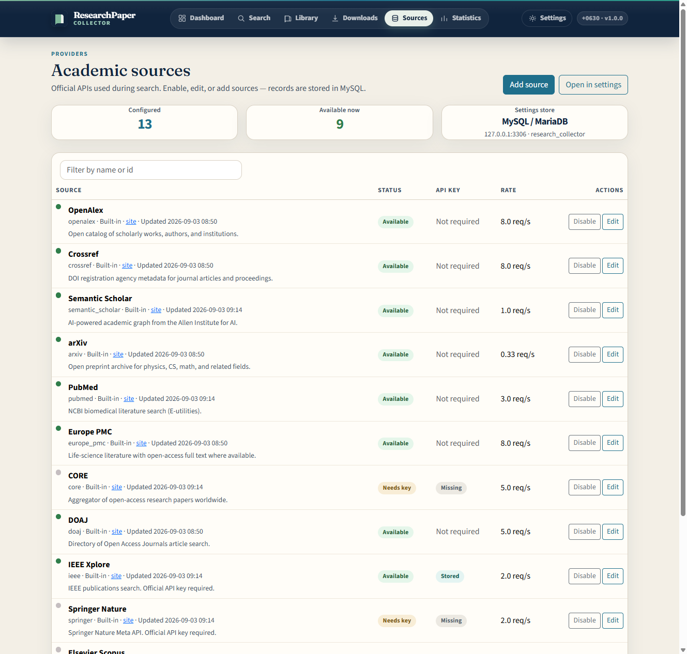
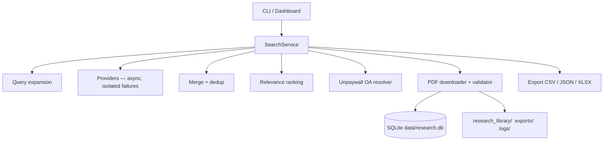

<p align="center">
  
</p>

<h1 align="center">Cyber Scholar</h1>

<p align="center">
  <strong>Myanmar Space Agency</strong>
</p>

<p align="center">
  Search trusted academic APIs, collect paper metadata, and download only legally available open-access PDFs.
</p>

<p align="center">
  Built for literature reviews in space systems, cybersecurity, AI, satellite security, and intrusion detection — without paywall bypass.
</p>

<p align="center">
  <a href="https://github.com/Coder-MoeTain/pdf_downloader/stargazers"></a>
  <a href="LICENSE"></a>
  
  
  
  <a href="COMPLIANCE.md"></a>
</p>

<p align="center">
  
</p>

<p align="center">
  
</p>

<p align="center">
  <sub>Dashboard · overview metrics, publications by year, access mix, and quick actions</sub>
</p>

---

## What it does

**Cyber Scholar** talks to **official academic APIs**, merges and ranks results, finds **open-access full text** (including Unpaywall), then stores validated PDFs in a local library.

It does **not** scrape Google Scholar, ResearchGate, or Academia.edu. It does **not** bypass paywalls, CAPTCHAs, `robots.txt`, or subscription gates. Paywalled works keep their DOI and publisher URL for lawful follow-up. See [COMPLIANCE.md](COMPLIANCE.md).

## Features

- **Multi-source search** — 30+ official APIs (OpenAlex, Crossref, arXiv, PLOS, OpenAIRE, HAL, Zenodo, and more). IEEE / Springer / Elsevier / NASA ADS when keys are present
- **Persistent search queue** — per-user jobs with live progress logs; queued jobs stay visible in the log until they finish
- **Source crawler** — harvest metadata from configured academic sources (admin); crawl queue uses the same reliable progress tracking as search
- **Query expansion** with configurable synonyms
- **DOI normalization** and fuzzy duplicate detection
- **Relevance ranking** (keyword by default; optional `sentence-transformers`)
- **Open-access detection** via provider metadata and Unpaywall
- **Validated PDF downloads** (`Content-Type`, `%PDF-` magic bytes, size limits, SHA-256)
- **Resume-safe downloads** with retries and status tracking
- **SQLite paper library**, CSV / JSON / XLSX reports, and per-topic `metadata.csv`
- **Interactive CLI** and an optional **FastAPI dashboard** with light / dark theme
- **Optional local full-text index** with PyMuPDF
- **Scheduled topic updates** from `config.yaml`

## Screenshots

<table>
  <tr>
    <td width="50%">
      
      <p align="center"><sub>Search official APIs with year, source, and OA filters</sub></p>
    </td>
    <td width="50%">
      
      <p align="center"><sub>Library with detail modal, category sidebar, and legal PDF actions</sub></p>
    </td>
  </tr>
  <tr>
    <td width="50%">
      
      <p align="center"><sub>Dashboard · KPIs, charts, and quick actions</sub></p>
    </td>
    <td width="50%">
      
      <p align="center"><sub>Enable, rate-limit, and key the academic providers</sub></p>
    </td>
  </tr>
</table>

## Architecture



Providers share a common `ResearchProvider` interface (`search`, `get_paper`, `find_pdf`). Adding a source means implementing that interface and registering it in `app/providers/__init__.py`.

## Supported sources

| Source | API key | Notes |
| --- | --- | --- |
| OpenAlex | No | Polite pool via contact email |
| Crossref | No | Polite pool via contact email |
| Semantic Scholar | Optional | Higher rate limit with a key |
| arXiv | No | Preprint PDFs are public |
| PubMed | Optional NCBI key | Biomedical literature (E-utilities) |
| Europe PMC | No | OA full-text URLs when provided |
| CORE | **Required** | Institutional-repository OA |
| DOAJ | No | Directory of Open Access Journals |
| IEEE Xplore | **Required** | Metadata; PDF only when the API marks OA |
| Springer Nature | **Required** | Metadata; PDF only for OA records |
| Elsevier / Scopus | **Required** | Metadata; no paywall bypass |
| NASA ADS | **Required** | Useful for space / satellite literature |
| NASA NTRS | No | NASA technical reports; public PDFs when listed |
| OpenAIRE | No | European Open Science Graph |
| HAL | No | French national open archive |
| Zenodo | No | CERN repository; public files when listed |
| DBLP | No | Computer-science bibliography (metadata) |
| PLOS | No | Fully open-access journals |
| ERIC | No | U.S. education research; hosted PDFs when listed |
| DOE OSTI | No | U.S. Department of Energy reports |
| DataCite | No | DOI metadata for texts, reports, and theses |
| OSF Preprints | No | OSF / PsyArXiv / SocArXiv and related servers |
| bioRxiv | No | Biology preprints (Crossref container filter) |
| medRxiv | No | Health-science preprints (Crossref container filter) |
| Figshare | No | Open repository articles and preprints |
| DOAB | No | Directory of Open Access Books |
| SciELO | No | Latin American / Iberian OA journals |
| CiNii | No | Japanese academic article index |
| INSPIRE-HEP | No | High-energy physics; arXiv PDFs when listed |
| Fatcat / IA Scholar | No | Internet Archive preserved OA files |
| World Bank OKR | No | World Bank Open Knowledge Repository |
| OAPEN | No | Open-access scholarly books |
| EconStor | No | Economics working papers and articles |
| PubMed Central | Optional NCBI key | Full-text archive; PMC PDFs when a PMCID exists |
| ChemRxiv | No | Chemistry preprints (Crossref container filter) |
| SSRN | No | Working papers via Crossref DOI prefix |
| Research Square | No | Preprints via Crossref DOI prefix |
| TechRxiv | No | IEEE TechRxiv preprints (Crossref DOI prefix) |
| PeerJ | No | Fully open-access journals |
| F1000Research | No | Open-access articles (Crossref container filter) |
| NBER | No | Working papers via Crossref DOI prefix |
| EarthArXiv | No | Earth-science preprints (Crossref container filter) |
| OpenReview | No | Open peer review; public PDFs when listed |
| eLife | No | Fully open-access life-science journal |
| SciPost | No | Diamond OA journals; publisher PDFs when listed |
| Papers with Code | No | ML papers; arXiv PDFs when an arXiv id is listed |
| zbMATH Open | No | Mathematics bibliography (metadata) |
| USGS Publications | No | USGS reports; public PDFs when listed |
| Harvard Dataverse | No | Research datasets and related outputs |
| FAO Knowledge Repository | No | FAO open publications |
| WHO IRIS | No | WHO institutional repository |
| CERN CDS | No | CERN repository; public files when listed |
| NDL Search | No | National Diet Library (Japan) article index |
| Unpaywall | Email required | OA PDF discovery, not a search index |

ResearchGate, Google Scholar, and Academia.edu have no public search APIs and prohibit automated access, so they are not connectors. Papers that also appear on those sites are still found through Crossref, OpenAlex, Unpaywall, and CORE when a DOI or repository copy exists.

MDPI, Frontiers, ACM, Wiley, Nature, institutional repositories, NIST, and government reports are covered when they appear in Crossref / OpenAlex / Unpaywall OA metadata. PLOS has a dedicated connector. The app never scrapes publisher HTML.

## Installation

Python **3.10+** is required.

```bash
git clone https://github.com/Coder-MoeTain/pdf_downloader.git
cd pdf_downloader

python -m venv venv
```

**Windows**

```bash
venv\Scripts\activate
```

**macOS / Linux**

```bash
source venv/bin/activate
```

Then:

```bash
pip install -r requirements.txt
cp .env.example .env
python main.py
```

## API key configuration

Edit `.env` (never commit real keys):

```env
CONTACT_EMAIL=you@university.edu
UNPAYWALL_EMAIL=you@university.edu
SEMANTIC_SCHOLAR_API_KEY=
CORE_API_KEY=
SPRINGER_API_KEY=
ELSEVIER_API_KEY=
IEEE_API_KEY=
NCBI_API_KEY=
NASA_ADS_TOKEN=
```

`CONTACT_EMAIL` should be a real address so Crossref, OpenAlex, and Unpaywall can place you in their polite pools. Ranking weights, provider rate limits, and synonym lists live in `config.yaml`.

Optional Google sign-in for the dashboard uses `GOOGLE_CLIENT_ID`, `GOOGLE_CLIENT_SECRET`, `GOOGLE_ADMIN_EMAILS`, and `SESSION_SECRET`. Settings and the source catalog can use MySQL when `MYSQL_HOST` is set.

## Search examples

```bash
python main.py search "reinforcement learning penetration testing"
```

```bash
python main.py search "web application vulnerability detection" --year-from 2022 --year-to 2026 --max-results 100
```

```bash
python main.py search "machine learning web application security" --year-from 2023 --open-access-only --max-results 200 --sort relevance
```

Search without downloading:

```bash
python main.py search "machine learning IDS" --no-download
```

Only open access:

```bash
python main.py search "satellite cybersecurity" --open-access-only
```

Filters: `--year-from`, `--year-to`, `--authors`, `--journal`, `--publisher`, `--source`, `--open-access-only`, `--max-results`, `--min-citations`, `--sort relevance|citations|newest`, `--download-limit`, `--max-file-size 50MB`.

## Other commands

```bash
python main.py                 # interactive menu
python main.py download
python main.py list
python main.py stats
python main.py retry
python main.py export
python main.py providers
python main.py library-search "SQL injection"
python main.py index-pdfs
python main.py fulltext-search "reinforcement learning reward function"
python main.py update-library
python main.py sync-lms
```

`update-library` reads saved topics from `config.yaml` and can be scheduled with cron, Windows Task Scheduler, or a systemd timer.

`sync-lms` copies downloaded open-access PDFs into the sibling **e-library** app as e-books (title, authors, abstract, DOI, first-page cover). It matches existing rows only by exact `Collector-Paper-ID` or exact `DOI:` line, so a second run imports anything still missing. Search and download already run this automatically when `LMS_SYNC_ENABLED=true`.

### e-library on the same Linux server

Typical layout:

```text
/var/www/
├── elibrary/          # Node library app (package.json, server.js, .env)
├── html/
└── pdf_downloader/
```

Set this in `pdf_downloader/.env`:

```env
LMS_SYNC_ENABLED=true
LMS_ROOT=/var/www/elibrary
```

The collector reads `/var/www/elibrary/.env` (`DB_HOST`, `DB_NAME`, `DB_USER`, `DB_PASSWORD`) and inserts rows into that MySQL database (`ebooks`, `author`, `category`). Files go to `elibrary/public/uploads/eBooks` and `elibrary/public/uploads/covers`.

```bash
cd /var/www/pdf_downloader
source venv/bin/activate
python main.py sync-lms
python main.py watch-lms
```

`watch-lms` keeps running in the background and imports each newly downloaded PDF into e-library. Run it under PM2:

```bash
cd /opt/apps/pdf_downloader
source venv/bin/activate
pm2 start "python main.py watch-lms" --name lms-sync --cwd /opt/apps/pdf_downloader
pm2 save
```

The dashboard also starts this watcher on boot. After a search/download, papers appear under **Admin → Imported papers** (and in **e-Books**).

## Web dashboard

```bash
uvicorn app.web:app --reload --host 127.0.0.1 --port 8000
```

Open [http://127.0.0.1:8000](http://127.0.0.1:8000)

Pages: **Dashboard**, **Search**, **Library**, **Downloads**, **Sources**, **Crawler** (admin), **Settings**.

### Dashboard UI

- **Cyber Scholar** branding with logo, favicon, and **Myanmar Space Agency** subtitle
- Redesigned **Dashboard** — KPI cards with icons, quick actions, publications-by-year chart, access mix, and recent searches
- **Light / dark theme** — sun/moon toggle in the header (and on the login page); preference saved in the browser and applied before first paint to avoid flash
- **Settings** sidebar navigation with icons for each section
- **Library** — streamlined filters (search, year, sort, PDF toggle, category sidebar); **Detail** modal shows authors, year, rating, status, and categories; PDF preview stays open while the live-results view refreshes in the background
- **Search & Crawler** — live job cards and queue groups with readable progress logs; status banners and progress panels use transparent backgrounds in dark mode
- **Search & download progress** — dashboard “Live” card and Downloads progress panel show real-time counts (e.g. `Downloading 14 of 100`) with log output; large PDF batches run in a background worker so other pages stay responsive

Open [http://127.0.0.1:8000/login](http://127.0.0.1:8000/login) to create the first **admin** account (email and password). After that, every visitor must log in. **User** accounts can search and use the library; **admin** accounts also open Sources, Crawler, Settings, and User settings people/roles. Signed-in accounts see **User settings** and **Log out** in the header. Google sign-in is optional when `GOOGLE_CLIENT_ID` is set.

On a server you can seed the default admin instead:

```bash
python main.py seed-admin
```

Default login is `admin@localhost` / `Admin@123`. Override with `--email`, `--password`, `--name`, or `ADMIN_EMAIL` / `ADMIN_PASSWORD` / `ADMIN_NAME` in `.env`. Use `--reset-password` if the account already exists.

## Database

SQLite file: `data/research.db`

Tables: `papers`, `authors`, `paper_authors`, `search_queries`, `search_results`, `downloads`, `providers`, `paper_fulltext`.

Paper status values: `FOUND`, `OA_AVAILABLE`, `DOWNLOADING`, `DOWNLOADED`, `PAYWALLED`, `NO_PDF`, `FAILED`, `DUPLICATE`, `SKIPPED`.

Paywalled works keep DOI, title, and publisher URL for lawful follow-up (library access, author request). They are never downloaded.

## Folder structure

```text
research_library/
├── reinforcement_learning/
│   ├── 2026/
│   ├── 2025/
│   └── metadata.csv
exports/
├── web_security_2026-09-02.csv
├── web_security_2026-09-02.json
└── web_security_2026-09-02.xlsx
logs/
├── app.log
├── download.log
└── error.log
```

PDF names look like `2025_Smith_Autonomous_Penetration_Testing_10.1234_abc.pdf`.

Excel workbooks include sheets: Summary, Downloaded, Open Access, Paywalled, Failed, All Papers, Sources.

## Legal / open-access policy

1. Prefer official APIs.
2. Download only public OA publisher PDFs, arXiv, PMC, Europe PMC, CORE, DOAJ, repository deposits, and government publications.
3. Respect rate limits, `Retry-After`, and `robots.txt`.
4. Do not rotate IPs, defeat CAPTCHAs, or use publisher credentials to scrape closed content.
5. Validate every file as a real PDF before storing it.

Full rules: [COMPLIANCE.md](COMPLIANCE.md).

## Troubleshooting

| Problem | What to try |
| --- | --- |
| Zero results | Check network access; try a broader query; confirm providers with `python main.py providers` |
| Unpaywall skipped | Set `CONTACT_EMAIL` / `UNPAYWALL_EMAIL` to a real mailbox |
| CORE / IEEE / Springer unused | Add the matching API key to `.env` |
| NASA ADS unused | Create a free token at [NASA ADS API help](https://ui.adsabs.harvard.edu/help/api/) and store it as `NASA_ADS_TOKEN` |
| 429 errors | Lower `requests_per_second` in `config.yaml`; the client already backs off |
| HTML saved instead of PDF | The validator rejects non-PDF bodies; check `logs/download.log` |
| Library Detail shows empty fields | Hard-refresh the page; paper metadata is embedded in the Detail button as JSON |
| Theme looks wrong after update | Hard-refresh (`Ctrl+Shift+R` / `Cmd+Shift+R`) so `theme.css` reloads |
| Pages hang during large PDF downloads | Downloads now run in a background worker; refresh or open another tab — the server should stay responsive |
| Semantic ranking | Install `sentence-transformers` and set `ranking.semantic.enabled: true` |

## Development

```bash
pip install -r requirements.txt
python main.py providers
pytest
```

Type hints are used throughout. Provider failures are isolated and do not abort a search.

Unit tests cover DOI/title normalization, deduplication, ranking, merge, filename sanitization, PDF validation, retries, rate limiting, database operations, and provider parsing with mocked payloads. External HTTP APIs are not called in CI.

## Roadmap

- Additional publisher connectors as official APIs allow
- Optional sentence-transformer ranking without a separate extra file
- Saved-search notifications
- Dedup against an existing Zotero / BibTeX library
- Packaging as `pip install cyber-scholar`

## License

[MIT](LICENSE) © Cyber Scholar / Myanmar Space Agency contributors

---

<p align="center">
  
</p>

<p align="center">
  <strong>Made with ❤️ by <a href="https://github.com/Coder-MoeTain">Coder-MoeTain</a> · Myanmar Space Agency</strong>
</p>
