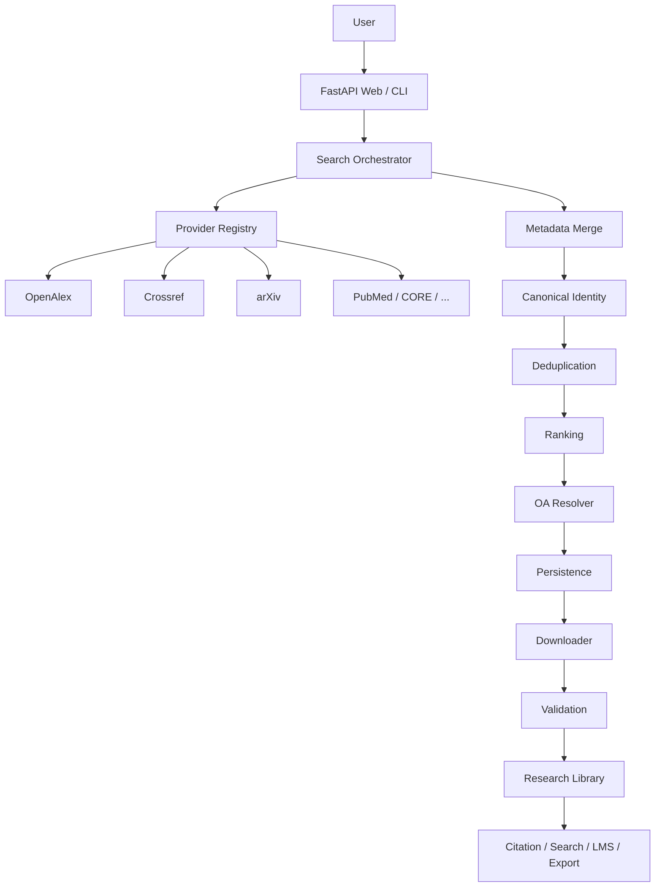

# Architecture

Cyber Scholar is a FastAPI application with a CLI, SQLite research library, optional MySQL/MariaDB settings store, and a legal open-access PDF downloader.

## Auth

Anonymous visitors never become administrators. With zero users, only `/setup`, `/login`, `/static`, health, and OAuth callbacks are public. A one-time bootstrap token is logged at startup; `/setup` consumes it to create the first admin.

## Providers

Logical sources may share an upstream. Crossref-backed publisher profiles use `rate_limit_group=crossref` so they share one limiter and circuit breaker.

## Secure networking

`AsyncHttpClient` validates every hop: scheme, hostname, resolved IPs, and redirect targets. PDF downloads use the same client (`stream_download` / `safe_stream`).

## Databases

- SQLite: papers, downloads, users, identifiers, collections, notes, CFP cache, jobs
- Optional MySQL: application settings and source catalog
- Alembic: `alembic upgrade head` for schema evolution

## Deployment

Bind Uvicorn to `127.0.0.1` and terminate TLS on Nginx/Apache. Set `TRUSTED_PROXY_IPS` to the proxy address only — never `*`.
